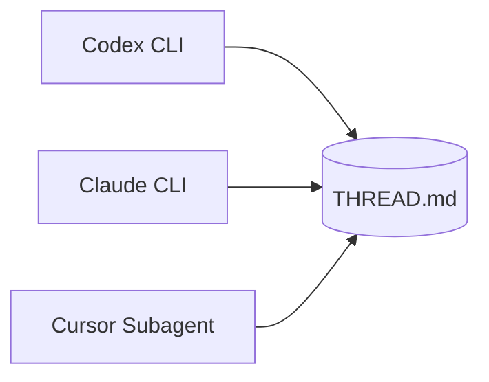

# Agent Roundtable

A file-based multi-agent orchestration substrate for Cursor IDE. Three actor types — **Codex CLI**, **Claude Code CLI**, and **Cursor Task subagents** — take turns around a shared on-disk thread, producing an append-only audit trail.



---

## Modes

The skill supports four collaboration patterns, ordered by complexity:

### Mode 1 — Single turn (cheapest, fastest)

One agent does one task. Use for quick reviews, one-shot generation, simple discussions.

```bash
$SKILL/scripts/codex_turn.sh my-thread --role discussant -m gpt-5.5 --task "..."
```

### Mode 2 — Sequential rounds (planner → executor → reviewer)

Each turn appends to `THREAD.md`; the next turn reads the prior turn's `**Did**` / `**Verification**` as context. Use for implementing a feature with explicit plan + check.

```bash
$SKILL/scripts/claude_turn.sh my-thread --role planner   -m claude-4.7-opus --effort high --task "..."
$SKILL/scripts/codex_turn.sh  my-thread --role executor  -m gpt-5.5 --effort high --task "..."
$SKILL/scripts/claude_turn.sh my-thread --role reviewer  -m claude-4.7-opus --task "..."
```

### Mode 3 — Parallel reviewers (cross-vendor, anti-sycophancy)

2–3 reviewers from **different** actor families review the same artifact, all with `--blind` (no peeking at prior verdicts → 85% sycophantic-agreement rate avoided, per arXiv 2605.00914). At least one uses `--role devils-advocate`. Each agent independently produces a structured JSON verdict in its turn's `**Verification**` block.

```bash
# Run two in parallel — Cursor's parallel tool calls (NOT shell '&')
$SKILL/scripts/codex_turn.sh  my-thread --role reviewer        -m gpt-5.5 --blind --task "..."  &
$SKILL/scripts/claude_turn.sh my-thread --role devils-advocate -m claude-4.7-opus --blind --task "..."
wait
```

### Mode 4 — Full quality loop (4-phase, highest confidence)

Plan → Execute → Parallel Review (≥2 actors, ≥1 devils-advocate, all `--blind`) → Aggregate (high-capability model **selects** the most defensible verdict; never blends). See `SKILL.md § Quality mode`.

Stop when ≥1 reviewer accepts with zero BLOCKERs AND ≤1 reviewer dissenting.

---

## Quick Start

Requires bash 4+, Python 3.9+, git, and at least one agent CLI (`codex`, `claude`, or Cursor subagents).

```bash
git clone https://github.com/JinPLu/agent-roundtable.git ~/.cursor/skills/agent-roundtable
SKILL=~/.cursor/skills/agent-roundtable

# 0. Configure model endpoints (one-time, see SKILL.md § Setup)
$SKILL/scripts/backend.sh init
# edit $SKILL/models.json — fill 4 fields per model
$SKILL/scripts/backend.sh apply

# 1. From your project root, create a thread
cd /path/to/your/project
$SKILL/scripts/new_thread.sh my-review "Audit auth module for security issues"

# 2. Edit .roundtable/threads/my-review/GOAL.md with acceptance criteria

# 3. Pick a mode above and dispatch.

# 4. Compact long threads when needed
$SKILL/scripts/compact_thread.sh my-review --keep 6
```

`ROUNDTABLE_PROJECT_ROOT` auto-detects to your project's git toplevel; threads live at `$PROJECT_ROOT/.roundtable/threads/<slug>/`.

---

## Turn script flags (minimal — 5 max)

```
codex_turn.sh / claude_turn.sh <slug> --role ROLE [-m MODEL] [--effort LEVEL] [--task TEXT|--task-file FILE] [--blind]
```

- `--role`: `planner | executor | reviewer | reviewer-aggregator | devils-advocate | discussant`
- `-m / --model`: model alias from `models.json` (default: from `role_defaults`)
- `--effort`: `low | medium | high` (default: medium for codex, high for claude)
- `--task` or `--task-file`: per-turn instruction
- `--blind`: required for parallel reviewers (suppresses prior verdict injection)

Everything else (sandbox, permission-mode, allowed-tools, timeout) defaults sensibly per role. Override via env vars (`ROUNDTABLE_TIMEOUT_S`) only when needed.

---

## Files

| Path | Description |
|---|---|
| `SKILL.md` | Full protocol spec (read by Cursor as the skill definition) |
| `models.example.json` | Shipped model catalog with benchmarks, pricing, role defaults |
| `models.json` | User's working copy (gitignored, chmod 600) |
| `scripts/` | Turn dispatch, routing, thread creation, compaction |
| `roles/*.system.md` | Per-role system prompts |
| `roles/reviewer.schema.json` | Strict JSON verdict schema |
| `docs/` | Deep-dive references (one level deep from SKILL.md) |
| `templates/` | Prompt templates for new threads |

## Reference

See [SKILL.md](SKILL.md) for the full protocol specification, including dispatch confirmation block, hard rules, model selection principles, and CLI tool policy.

## License

[MIT](LICENSE)
