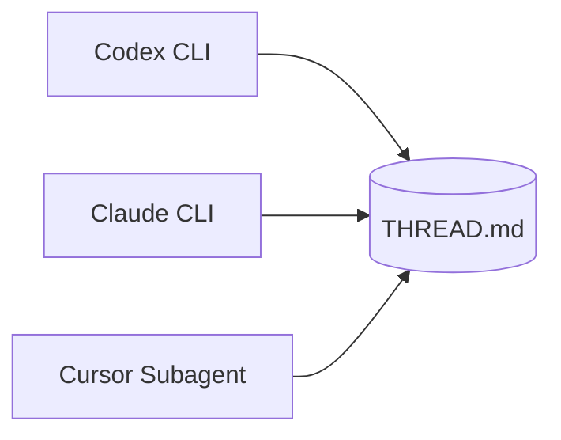

# Agent Roundtable

A file-based multi-agent orchestration substrate for Cursor IDE. Three actor types — **Codex CLI**, **Claude Code CLI**, and **Cursor Task subagents** — take turns around a shared on-disk thread, producing an append-only audit trail.



## Quick Start

Requires bash 4+, Python 3.9+, git, and at least one agent CLI (`codex`, `claude`, or Cursor subagents).

```bash
SKILL=~/.cursor/skills/agent-roundtable

# 1. Create a thread
$SKILL/scripts/new_thread.sh my-review "Audit auth module for security issues"

# 2. Edit GOAL.md with acceptance criteria

# 3. Check routing recommendations
$SKILL/scripts/route.sh --role planner --budget cheap

# 4. Dispatch turns
$SKILL/scripts/claude_turn.sh my-review --role planner --model claude-4.7-opus \
  --addendum "Output artifacts/plan.md with concrete fixes."

$SKILL/scripts/codex_turn.sh my-review --role executor --effort high \
  --addendum "Implement the plan; run pytest."

$SKILL/scripts/claude_turn.sh my-review --role reviewer --model claude-4.7-opus --bare \
  --addendum "Review against GOAL.md acceptance criteria."

# 5. Compact long threads
$SKILL/scripts/compact_thread.sh my-review --keep 6
```

## Installation

```bash
git clone https://github.com/JinPLu/agent-roundtable.git ~/.cursor/skills/agent-roundtable
```

## Files

| Path | Description |
|---|---|
| `SKILL.md` | Full protocol spec (read by Cursor as the skill definition) |
| `models.json` | Model registry with benchmarks, pricing, and routing defaults |
| `scripts/` | Turn dispatch, routing, thread creation, and compaction scripts |
| `roles/` | Per-role system prompts and reviewer verdict schema |
| `templates/` | Prompt templates |

## Reference

See [SKILL.md](SKILL.md) for the full protocol specification.

## License

[MIT](LICENSE)
